# XÂY DỰNG HỆ THỐNG DATA LAKEHOUSE CHO BÀI TOÁN THƯƠNG MẠI ĐIỆN TỬ
**(EcomLake Project)**

> 📖 **Đọc bài viết phân tích kiến trúc chi tiết bằng Tiếng Việt tại:** [Sổ Tay Kỹ Thuật Dữ Liệu](https://kythuatdulieu.github.io/projects/e2e/ecomlake/)

**Credit:** Thank for Thanh Hùng

---

## Mục lục
1. [Tổng Quan Kiến Trúc Hệ Thống](#1-tổng-quan-kiến-trúc-hệ-thống)
2. [Chi Tiết Các Phân Hệ Chức Năng](#2-chi-tiết-các-phân-hệ-chức-năng)
    - [2.1. Phân Hệ Điều Phối và Tính Toán (Orchestration & Computing)](#21-phân-hệ-điều-phối-và-tính-toán-orchestration--computing)
    - [2.2. Phân Hệ Lưu Trữ Data Lakehouse (Storage Layer)](#22-phân-hệ-lưu-trữ-data-lakehouse-storage-layer)
    - [2.3. Phân Hệ Phân Tích và Trực Quan Hóa (Analytics & BI)](#23-phân-hệ-phân-tích-và-trực-quan-hóa-analytics--bi)
    - [2.4. Phân Hệ Vận Hành Học Máy (MLOps)](#24-phân-hệ-vận-hành-học-máy-mlops)
3. [Hướng dẫn Cài đặt & Vận hành (Getting Started)](#3-hướng-dẫn-cài-đặt--vận-hành)
4. [Kết Luận](#4-kết-luận)

---

## 1. Tổng Quan Kiến Trúc Hệ Thống

EcomLake được thiết kế theo kiến trúc Data Lakehouse phân tán, tích hợp các công nghệ xử lý dữ liệu lớn (Big Data) nhằm giải quyết bài toán về khả năng mở rộng (scalability), độ tin cậy (reliability) và hiệu năng (performance). Hệ thống tuân thủ nguyên tắc "Separation of Compute and Storage" (Tách biệt tính toán và lưu trữ), cho phép linh hoạt trong quản lý tài nguyên và tối ưu hóa chi phí hạ tầng (TCO).

**Các Thành Phần Cốt Lõi:**
- **Orchestration & Workflow (Điều phối):** Sử dụng Dagster định nghĩa và giám sát pipeline.
- **Distributed Computing (Tính toán phân tán):** Apache Spark đảm nhiệm xử lý dữ liệu quy mô lớn.
- **Storage (Lưu trữ):** MinIO (S3-compatible) kết hợp Delta Lake đảm bảo tính ACID.
- **Analytics & BI (Phân tích):** Metabase và Streamlit trực quan hóa dữ liệu.
- **MLOps (Vận hành học máy):** MLflow quản lý vòng đời mô hình.

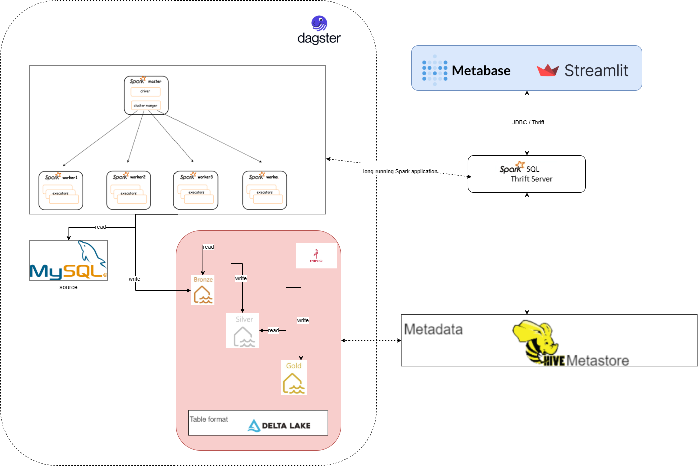
*Hình 1. Tổng quan kiến trúc*

---

## 2. Chi Tiết Các Phân Hệ Chức Năng

### 2.1. Phân Hệ Điều Phối và Tính Toán (Orchestration & Computing)

#### 2.1.1. Spark Master - Quản Trị Cụm Phân Tán
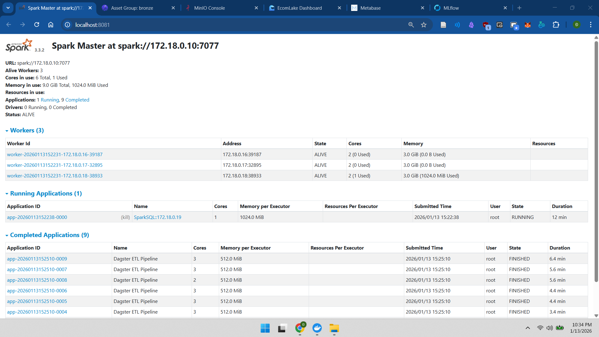
*Hình 2. Giao diện quản lý Spark Master Cluster*

**Vai trò hệ thống:**
Spark Master đóng vai trò Resource Manager trung tâm trong kiến trúc Master-Slave. Thành phần này chịu trách nhiệm:
- **Quản lý tài nguyên tập trung:** Phân bổ cores và RAM từ Worker nodes cho các ứng dụng.
- **Cơ chế Fault Tolerance:** Tự động điều hướng tác vụ khi Worker gặp sự cố, đảm bảo tính bền vững của hệ thống.

#### 2.1.2. Dagster - Quản Lý Luồng Dữ Liệu
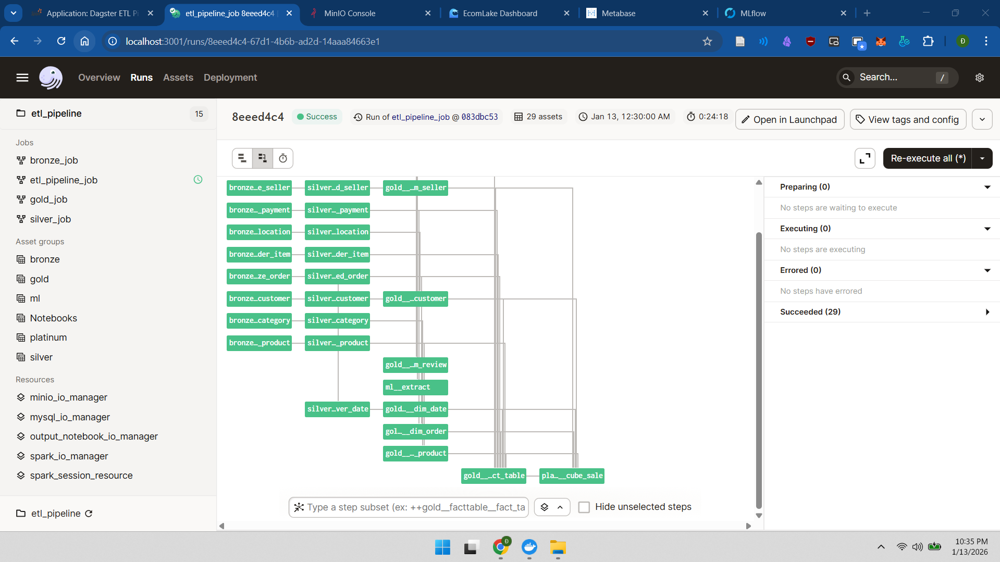
*Hình 3. Biểu đồ phụ thuộc dữ liệu (Data Lineage) trong Dagster*

**Cơ chế hoạt động:**
Hệ thống sử dụng Dagster để định nghĩa Software-Defined Assets (SDAs), cung cấp khả năng quan sát toàn diện (Observability) về luồng dữ liệu.
- **Data Lineage:** Theo dõi trực quan sự phụ thuộc giữa các bảng từ Bronze -> Silver -> Gold.
- **Tái tính toán thông minh:** Chỉ kích hoạt lại các pipeline bị ảnh hưởng khi dữ liệu nguồn thay đổi, tối ưu hóa tài nguyên tính toán.

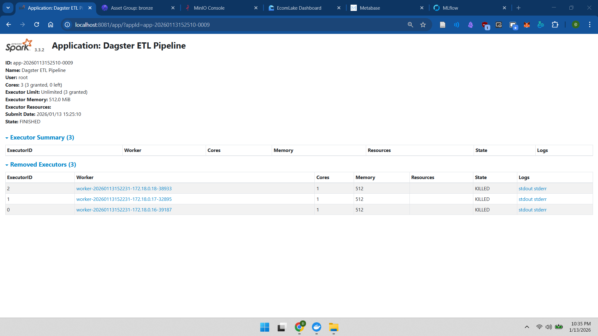
*Hình 4. Trạng thái thực thi Distributed Tasks trên Spark Cluster*

---

### 2.2. Phân Hệ Lưu Trữ Data Lakehouse (Storage Layer)

#### 2.2.1. Kiến Trúc Lưu Trữ Đối Tượng (Object Storage)

*Hình 5. Cấu trúc Bucket Lakehouse trên MinIO*

**Giải pháp hạ tầng:**
Hệ thống triển khai MinIO làm giải pháp lưu trữ nền tảng. Việc tách biệt lớp lưu trữ (MinIO) khỏi lớp tính toán (Spark) mang lại lợi ích kép: khả năng mở rộng dung lượng lên Petabytes độc lập với tài nguyên tính toán và khả năng tích hợp chuẩn S3 API với mọi công cụ Big Data.

#### 2.2.2. Tổ Chức Dữ Liệu và Định Dạng Delta Lake
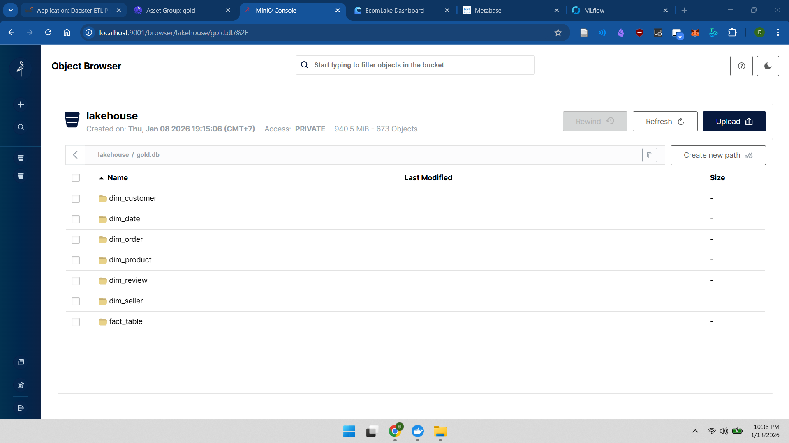
*Hình 6. Tổ chức dữ liệu tầng Gold (Star Schema)*

**Cấu trúc dữ liệu:**
Dữ liệu tại tầng Gold được tổ chức theo mô hình Star Schema (Fact & Dimension tables) để tối ưu cho các truy vấn phân tích (OLAP). Về mặt vật lý, dữ liệu được lưu trữ dưới định dạng Delta Lake (dựa trên Parquet + Transaction Log), đảm bảo:
- **ACID Transactions:** Toàn vẹn dữ liệu khi ghi/đọc đồng thời.
- **Lưu trữ hướng cột (Columnar Storage):** Tối ưu hóa I/O và nén dữ liệu hiệu quả.

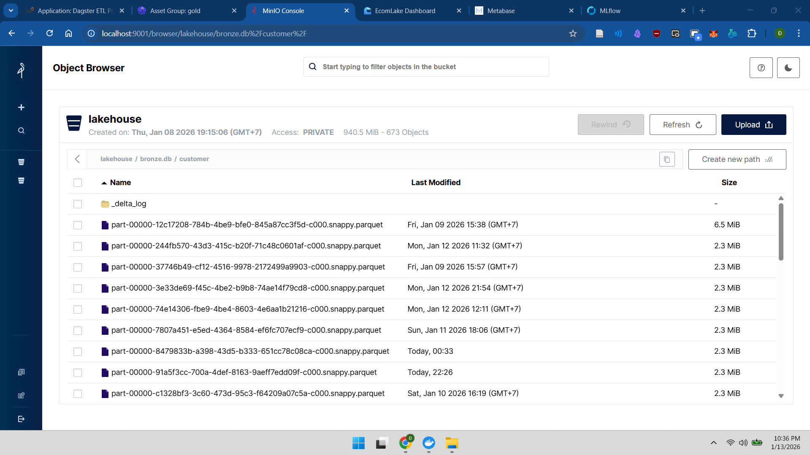
*Hình 7. Các Partition Files định dạng Parquet*

---

### 2.3. Phân Hệ Phân Tích và Trực Quan Hóa (Analytics & BI)

#### 2.3.1. Cổng Kết Nối Dữ thực Dữ Phân Tán
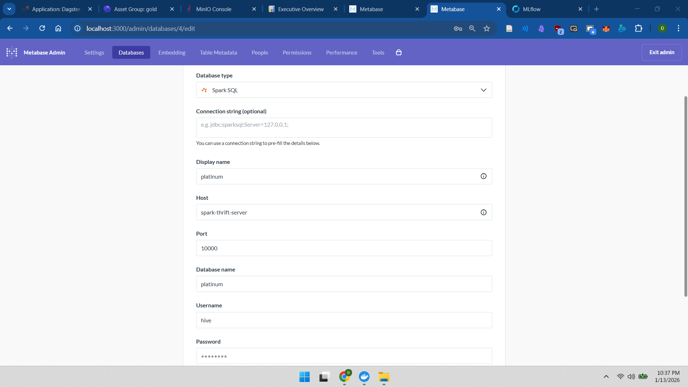
*Hình 8. Kết nối JDBC qua Spark Thrift Server*

**Cơ chế tích hợp:**
Hệ thống sử dụng Spark Thrift Server làm Gateway, cho phép các công cụ BI giao tiếp với Data Lakehouse qua giao thức JDBC chuẩn. Mọi truy vấn SQL từ người dùng được chuyển đổi thành Spark Jobs và thực thi phân tán, tận dụng sức mạnh xử lý của cụm.

#### 2.3.2. Ứng Dụng Dữ Liệu và Báo Cáo
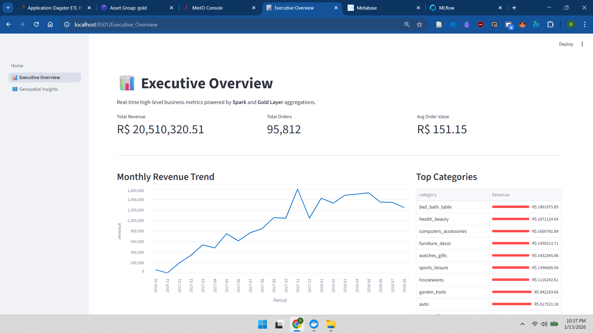
*Hình 9. Dashboard tổng hợp năng lực hệ thống*

Streamlit truy xuất dữ liệu đã được làm sạch và tổng hợp từ tầng Gold để hiển thị các chỉ số trọng yếu (KPIs) thời gian thực.
Đặc biệt, khả năng xử lý dữ liệu lớn được thể hiện qua Dashboard địa lý (Geospatial). Hệ thống đã tính toán trước (pre-compute) các chỉ số phức tạp trên hàng triệu bản ghi transaction tại tầng Gold, giúp việc hiển thị bản đồ nhiệt (Heatmap) diễn ra tức thì.

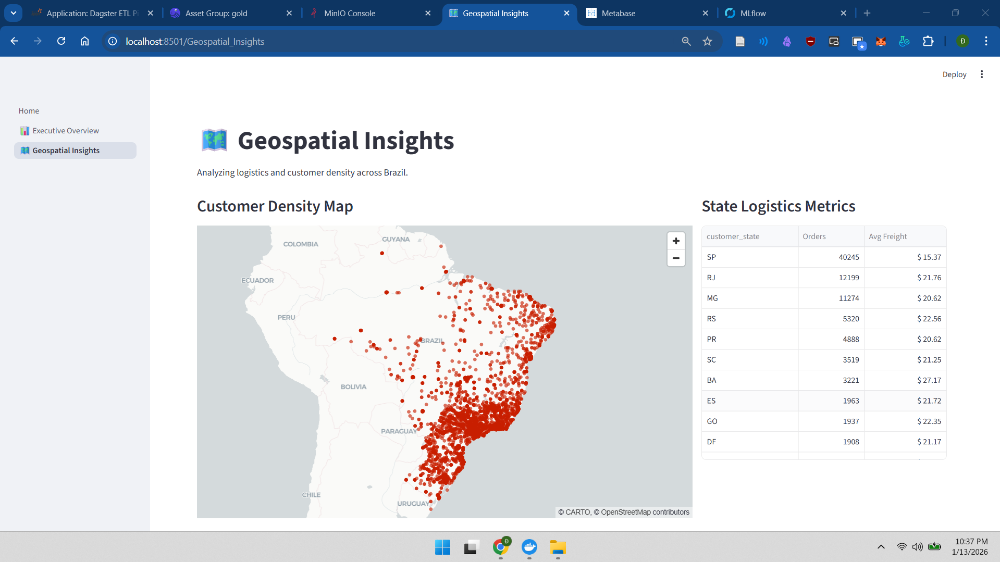
*Hình 10. Khả năng tổng hợp dữ liệu không gian lớn*

---

### 2.4. Phân Hệ Vận Hành Học Máy (MLOps)

#### 2.4.1. Quản Lý Vòng Đời Mô Hình
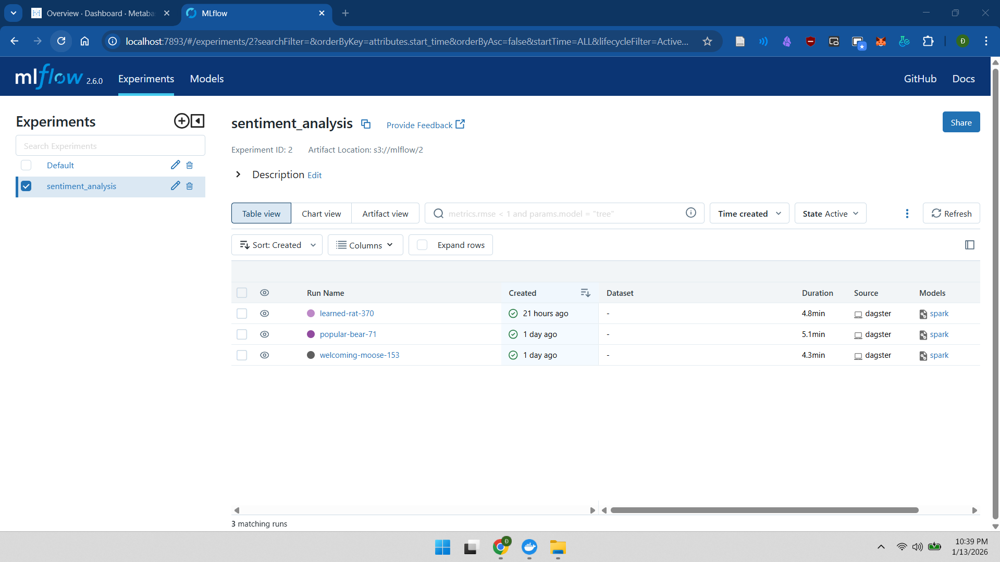
*Hình 11. Theo dõi thực nghiệm (Experiment Tracking) trên MLflow*

**Quy trình chuẩn hóa:**
Hệ thống tích hợp MLflow để kiểm soát toàn bộ quy trình Data Science. Mọi tham số (Hyperparameters), chỉ số đánh giá (Metrics) và môi trường thực thi đều được ghi lại tự động, đảm bảo tính tái lập (Reproducibility) của các thí nghiệm.

#### 2.4.2. Quản Lý Artifacts và Pipeline
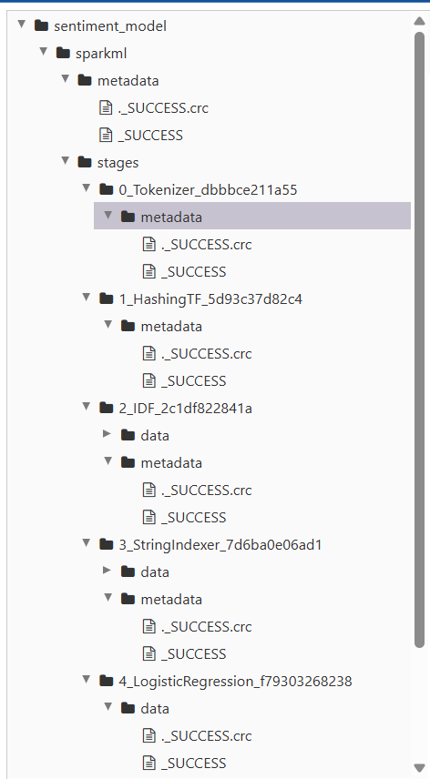
*Hình 12. Lưu trữ SparkML Pipeline*

Hệ thống lưu trữ không chỉ mô hình cuối cùng mà cả toàn bộ pipeline xử lý (Preprocessing + Modeling) dưới dạng serialized objects trong MinIO. Điều này loại bỏ hoàn toàn vấn đề sai lệch dữ liệu (Training-Serving Skew) khi triển khai mô hình vào thực tế.

---

## 3. Hướng dẫn Cài đặt & Vận hành

### Yêu cầu
- Docker và Docker Compose.
- Python 3.9+ (phát triển cục bộ).

### Cài đặt & Chạy hệ thống

1. **Clone repository:**
   ```bash
   git clone git@github.com:kythuatdulieu/EcomLake.git
   cd EcomLake
   ```

2. **Cài đặt Môi trường**
   Copy file môi trường mẫu:
   ```bash
   cp env.example .env
   ```

3. **Khởi động Hạ tầng:**
   ```bash
   docker compose up -d
   ```

4. **Kiểm tra trạng thái:**
   ```bash
   docker ps
   ```
   Đảm bảo các dịch vụ như `spark-master`, `minio`, `mysql`, `de_dagster_dagit`,... có trạng thái `Up`.

5. **Nạp dữ liệu ban đầu:**
   Dự án bao gồm `Makefile` để đơn giản hóa quá trình khởi tạo (bắt buộc cho lần chạy đầu tiên):
   - Tạo schema: `make mysql_create`
   - Nạp dữ liệu mẫu: `make mysql_load`

6. **Truy cập Dịch vụ**
   - **Dagster UI (ETL Orchestration):** [http://localhost:3001](http://localhost:3001)
   - **MinIO Console (Object Storage):** [http://localhost:9001](http://localhost:9001) (User/Pass: `minio` / `minio123`)
   - **Spark Master UI:** [http://localhost:8081](http://localhost:8081)
   - **Streamlit App (Dashboard):** [http://localhost:8501](http://localhost:8501)
   - **MLflow UI (Model Tracking):** [http://localhost:7893](http://localhost:7893)
   - **Metabase (BI):** [http://localhost:3000](http://localhost:3000)

---

## 4. Kết Luận

Kiến trúc EcomLake đã hiện thực hóa thành công mô hình Modern Data Lakehouse, giải quyết triệt để các thách thức của bài toán Big Data. Sự kết hợp chặt chẽ giữa Spark (Tính toán), MinIO (Lưu trữ), Dagster (Điều phối) và Metabase/Streamlit (BI) tạo nên một nền tảng dữ liệu thống nhất, mạnh mẽ và có khả năng mở rộng không giới hạn, phục vụ đắc lực cho cả nhu cầu Business Intelligence và Advanced Analytics.


